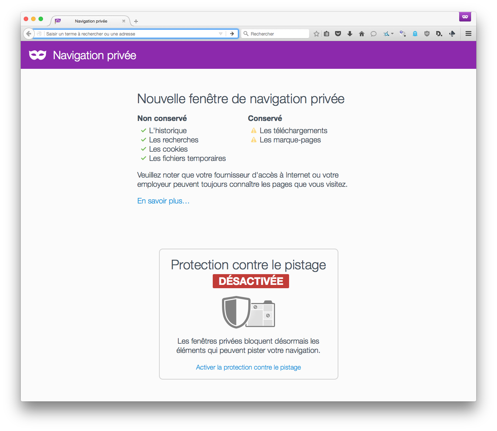

### Navigation privée

Finalement, vous pouvez également activer la navigation privée (Fichier > Nouvelle fenêtre de navigation privée) afin qu'aucune information ne soit enregistrée dans votre navigateur lorsque vous surfez.

Attention ! Cela n'efface pas les "traces" que vous laissez sur les sites que vous visitez, mais ceux-ci ne peuvent pas enregistrer de cookies dans votre navigateur pour vous pister. Cela ne chiffre pas non plus les communications.

---
*Notes personnelles*

